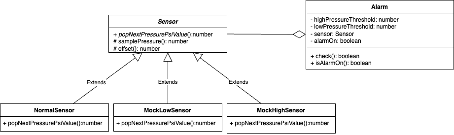

# Alarm-Sensor Kata

devs: Marc Girbau, Berenguer Pou

## Problem description:

Problems in alarm class: depedency inversion violation + OCP violation with sensor import and instantiation inside alarm class.

## Solution

Invert dependency of Sensor in Alarm class. Create sensor abstraction, use in sensor instances and inject them in alarm cosntructor. In order to test all behaviours, we can create our mock classes just for test purposes (not mocking methods in jest/vitest). Example: a fakeSensor.ts and pass desired pressure in constructor, in order to check low and high pressures that would trigger all the expected use case of alarm class.

## UML Diagram

